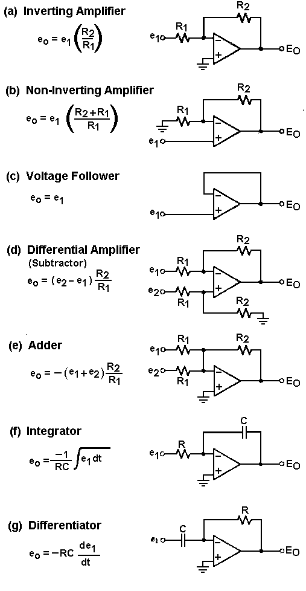

## Basics

* $V=IR$ | $P=IV$ | $P=\frac{V^2}{R}$
* $R_a\|R_b=\frac{R_a+R_b}{R_a*R_b}$
* Absorbed power = $V^2\over R$

## Circuit Analysis/Simplification

### Superposition

* For **Independent** Sources only:
* Current sources --> OC | Voltage sources --> SC
* Deactivate all but **1** source and solve the circuit. Repeat with a different source. Add the values for each component

### Thevenin/Norton with respect to a & b

* $V_{Th}$ is open circuit voltage between a and b
* Find $R_{Th}$ by removing sources like in superposition and find equivalent resistance between a and b
* Find $I_{SC}$ by shorting across a and b. $V_{Th}=I_{sc}R_{Th}$
* Norton: Take Thevenin and source transform into current source parallel to $R_{Th}$

### Source Transformation

* $V_s$ in series with R <--> $I_s$ in parallel with R

### Delta-Wye ($\Delta-Y$)

$\Delta$ to $Y$
$$ R_A = \frac{R_{AB}R_{AC}}{R_{AB}+R_{AC}+R_{BC}} $$
$$ R_B = \frac{R_{AB}R_{BC}}{R_{AB}+R_{AC}+R_{BC}} $$
$$ R_C = \frac{R_{AC}R_{BC}}{R_{AB}+R_{AC}+R_{BC}} $$
$Y$ to $\Delta$
$$ R_{AB}= \frac{R_A R_B + R_A R_C + R_B R_C}{R_C}$$
$$ R_{BC}= \frac{R_A R_B + R_A R_C + R_B R_C}{R_A}$$
$$ R_{AC}= \frac{R_A R_B + R_A R_C + R_B R_C}{R_B}$$

### Maximum Power Transfer

* $R_L=R_{Th}$ | $P=\frac{V_{Th}^2}{4R_L}$

### Op Amps

* Linear Region: $-V_{cc} \leq V_o \leq V_{cc}$
* $I_n=I_p=0$ | $V_n=V_p$
* Perform KCL @ inputs, Node voltage method

## Time Varying Sources

* $v(t) = V_m cos(\omega t + \phi)$ | $V_m$ is the amplitude, DC
* RMS for cos: $V_{rms}=\frac{V_m}{\sqrt{2}}$

### Inductors and Capacitors

* Capacitor:
  * $I=C \frac{dv}{dt}$ | $C=\frac{q}{v}$
  * $v(t)=\frac{1}{C} \int^{t}_{t_0} {i dt} + v(t_0)$
  * $P = vC\frac{dv}{dt}$ | $w=\frac{1}{2}Cv^2$

* Series
  * $\frac{1}{C_{eq}}=\sum{\frac{1}{C_n}}$
* Parallel
  * $C_{eq}=\sum{C_n}$

* Inductor:
  * $vdt=Ldi$
  * $i(t)=\frac{1}{L}\int_{t_0}^t{v dt} + i(t_0)$
  * $P=Li\frac{di}{dt}$ | $w=\frac{1}{2}Li^2$

  * Series
    * $L_{eq}=\sum{L_n}$
    * $v=\sum{L_n} \frac{di}{dt}$
  * Parallel
    * $\frac{1}{L_{eq}}=\sum{\frac{1}{L_n}}$
    * $i(t_0)=\sum{i_n(t_0)}$

### Trig Relationshiips and Angles

* $\cos(\omega t) = \sin(\omega t + \frac{\pi}{2}) = -\sin(\omega t - \frac{\pi}{2})$
* $\sin(\omega t) = \cos(\omega t - \frac{\pi}{2}) = -\cos(\omega t + \frac{\pi}{2})$
* In an inductorthe current lags voltage 90 degrees
* In a capacitive circuit, current leads voltage by 90 degrres

### Mutual Inductance

* Mutually induced voltage = $M\frac{di_2}{dt}$ where $I_2$ is the current in the other coil
* Dot convention:
  * When the reference direction for a current enters the dotted terminal of a coil, the reference polarity of the voltage that it induces in the other col is positive at its dotted terminal

### Impedance (Z)

Ohm's Law: V=I**Z**

* Resistor: $Z_R=R$
* Inductor: $Z_L=j \omega L$
* Capacitor: $Z_C=\frac{1}{j \omega C}$

Admittance is the reciprocal of impedance

### Phasors

$C=M \angle \theta = M \cos{(t \omega + \theta)}=Me^{j\theta}$

#### Forms

* Phasor: $C=M\angle\theta$
* Rectangular: $C=A+jB$

#### Conversion

* $M=\sqrt{A^2+B^2}$, $\theta=arctan{(\frac{B}{A})}$
* $A=M\cos{\theta}$, $B=M\sin{\theta}$

#### Phasor Math

Let $C_1=M_1 \angle \theta_1$ and $C_2=M_2 \angle \theta_2$

* $C_1 \times C_2 = M_1 \times M_2 \angle (\theta_1 + \theta_2)$
* $C_1 \div C_2 = \frac{M_1}{M_2} \angle(\theta_1-\theta_2)$